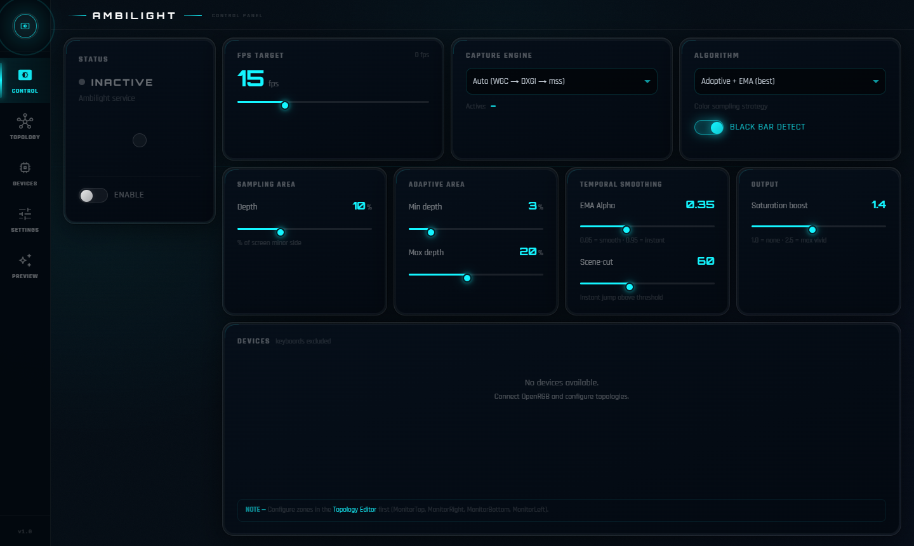
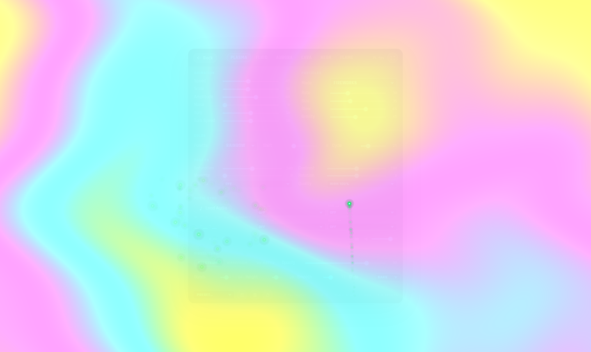
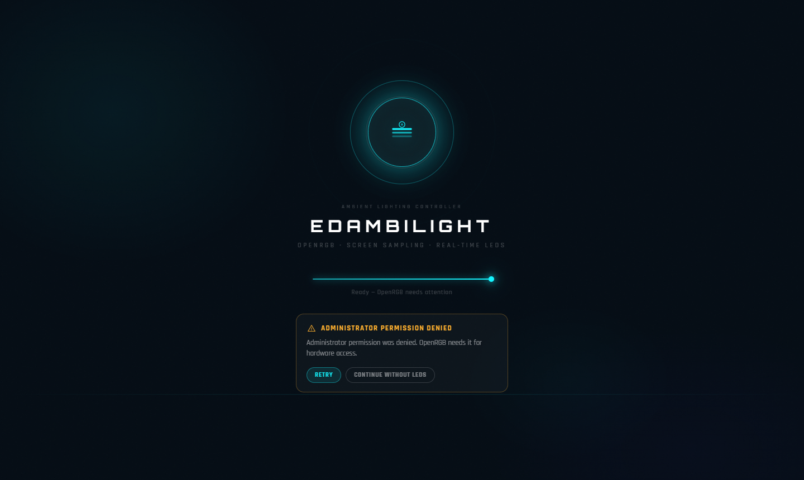
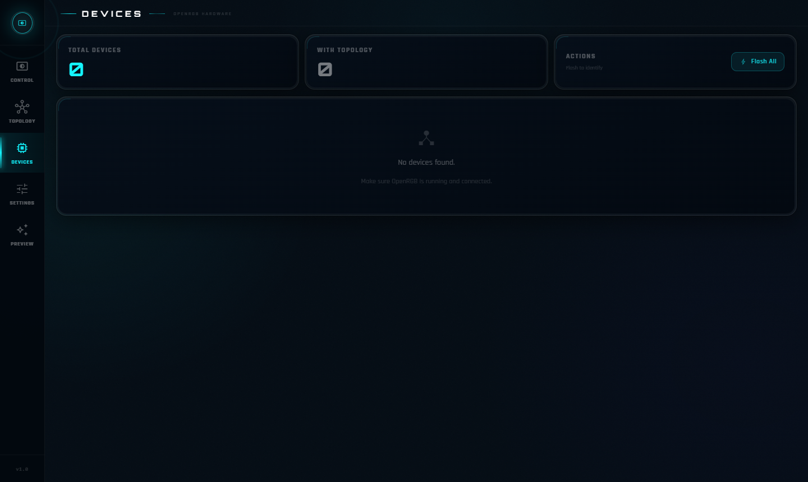
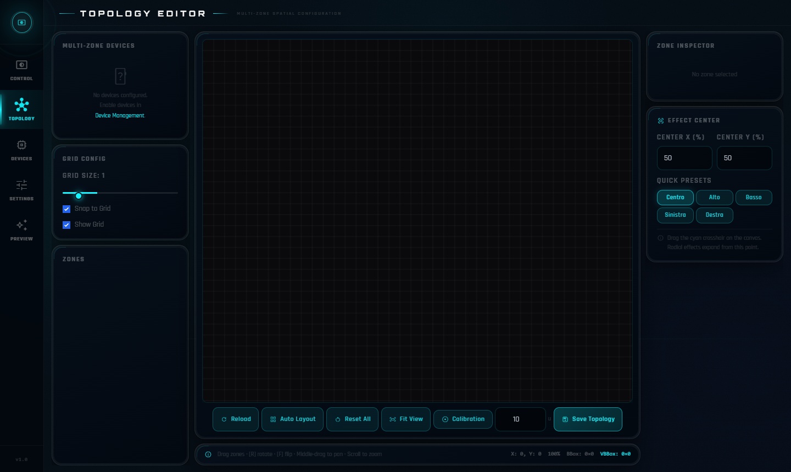
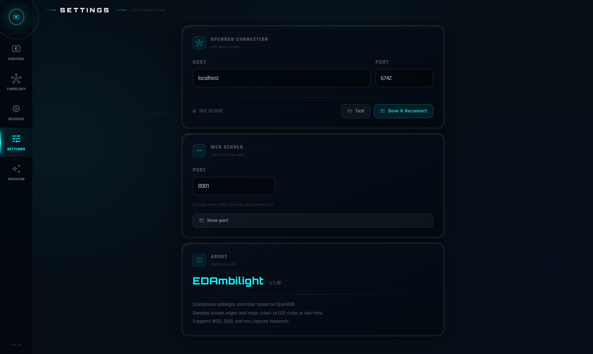

# EDAmbilight

**Real-time screen ambient lighting controller for OpenRGB**




---

## 📥 Download

➡️ **[Latest Release — v1.0.0](../../releases/latest)**

Download `EDAmbilight-v1.0.0.zip`, extract anywhere, run `EDAmbilight.exe`.
No Python or extra dependencies needed.

> **OpenRGB must be running** with the SDK Server enabled before launching EDAmbilight.
> In OpenRGB: *Settings → SDK Server → Start Server* (default port 6742)

---

## ✨ Features

- **Real-time screen capture** — samples all four monitor edges (right, top, left, bottom)
- **Smart sampling strategies** — adaptive depth, percentile, dominant color, mean, and smooth blending
- **Black bar detection** — automatically ignores letterbox / pillarbox borders
- **Scene-cut bypass** — instant color jump on hard cuts, smooth EMA transitions otherwise
- **Saturation boost** — vivid LED output without oversaturation
- **WebGL live preview** — visualise the ambient effect in the browser before it hits the LEDs



- **Visual topology editor** — drag-and-drop canvas to map LED zones to screen regions
- **System tray** — minimize to tray; reopen the UI from any browser tab
- **OpenRGB auto-start** — launches OpenRGB automatically if it is not already running
- **No internet required** — fully local, no telemetry, no cloud

---

## 🔧 Requirements

| | |
|---|---|
| OS | Windows 10 / 11 (64-bit) |
| [OpenRGB](https://openrgb.org) | v0.9 or later, SDK Server enabled |

---

## 🚀 Quick Start

1. Start **OpenRGB** → *Settings → SDK Server → Start Server*
2. Extract the release zip and run **EDAmbilight.exe**
3. The splash screen initialises and the dashboard opens automatically
4. On the **Devices** page, enable the LED zones you want to drive
5. Back on the **Dashboard**, toggle **Enable** — LEDs follow your screen in real time

---

## 🖥️ The Interface

### Splash Screen

Shown on every launch. Displays live progress as EDAmbilight connects to OpenRGB, starts the sampling service, and registers the API.



If OpenRGB is not reachable an error banner appears with a **Retry** button — start OpenRGB, enable the SDK Server, then click Retry without restarting the app.

* * *

### Dashboard — Control

The main page. All sampling parameters are adjustable in real time with instant effect on the LEDs.


| Control | Description |
|---|---|
| **Enable toggle** | Master on/off for ambilight output |
| **Capturer** | Screen capture backend (Auto / WGC / DXGI / mss) |
| **FPS Target** | Sampling rate in frames per second |
| **Strategy** | Color sampling algorithm (see Configuration) |
| **Depth min / max** | Adaptive sampling depth range as % of screen |
| **EMA Alpha** | Smoothing factor — higher = faster color response |
| **Scene-cut threshold** | Delta that triggers an instant cut instead of EMA |
| **Saturation boost** | Color intensity multiplier |

* * *

### Devices

Enable or disable individual LED devices and zones. Only enabled zones receive color data.



Click **Edit Topology** on any device to open the topology editor and map its zones to screen regions.

* * *

### Topology Editor

Drag LED zones onto the screen canvas and assign them to a monitor edge (Right / Top / Left / Bottom). Changes take effect immediately without restarting.



* * *

### Settings

Configure the OpenRGB connection (host, port, executable path) and the web UI port.



---

## ⚙️ Configuration

Configuration files are stored in the `config/` folder next to the exe and are created automatically on first run.

### `config/settings.json`

```json
{
  "openrgb_host": "localhost",
  "openrgb_port": 6742,
  "openrgb_path": "",
  "openrgb_autostart": true,
  "web_port": 8001
}
```

| Key | Default | Description |
|---|---|---|
| `openrgb_host` | `"localhost"` | OpenRGB SDK server hostname or IP |
| `openrgb_port` | `6742` | OpenRGB SDK server port |
| `openrgb_path` | `""` | Absolute path to `openrgb.exe` (empty = autodetect) |
| `openrgb_autostart` | `true` | Launch OpenRGB automatically if not running |
| `web_port` | `8001` | Port for the built-in web UI |

### `config/ambilight_config.json`

| Key | Default | Description |
|---|---|---|
| `enabled` | `true` | Master on/off |
| `capturer` | `"auto"` | `auto` \| `wgc` \| `dxgi` \| `mss` |
| `fps` | `10` | Target frames per second |
| `strategy` | `"adaptive_smooth"` | Sampling strategy (see below) |
| `depth` | `10` | Base sampling depth as % of screen |
| `saturation_boost` | `1.6` | Saturation multiplier |
| `ema_alpha` | `0.5` | EMA smoothing factor (0 = frozen, 1 = instant) |
| `scene_cut` | `43` | Per-LED delta that bypasses EMA |
| `adaptive_min` | `3` | Minimum adaptive depth % |
| `adaptive_max` | `18` | Maximum adaptive depth % |
| `black_bar_detect` | `true` | Skip letterbox / pillarbox borders |

**Sampling strategies**

| Strategy | Description |
|---|---|
| `adaptive_smooth` | Adaptive depth + EMA — recommended for most content |
| `smooth` | Fixed depth + EMA |
| `percentile` | 80th-percentile luminance — vibrant colors |
| `dominant` | Median pixel — stable, natural colors |
| `mean` | Average all pixels — accurate but can look washed out |

---

## 📊 How It Works

```
┌─────────────────────────────────────────────────────────────────┐
│  Screen Capture  (WGC → DXGI → mss, auto-selected)              │
│         ↓                                                       │
│  Black Bar Detection  →  content rect [x0,y0,x1,y1]             │
│         ↓                                                       │
│  Per-Edge Strip Extraction  (adaptive or fixed depth)           │
│         ↓                                                       │
│  Per-LED Segment Sampling  (percentile / dominant / mean)       │
│         ↓                                                       │
│  Saturation Boost                                               │
│         ↓                                                       │
│  Temporal Smoothing (EMA)  ←→  Scene-Cut Bypass                 │
│         ↓                                                       │
│  OpenRGB SDK  →  LED Strip / Mouse / Headset / RAM / Motherboard│
└─────────────────────────────────────────────────────────────────┘
```

The sampling loop runs as a background thread at the configured FPS. Each frame is captured once and shared across all active devices — the strip extraction cache means each screen edge is processed only once per frame regardless of how many devices or zones reference it.

---

## 🔍 Troubleshooting

**"OpenRGB not found" on the splash screen**
Make sure OpenRGB is running with the SDK Server enabled on port 6742.
If OpenRGB is in a non-standard location, set `openrgb_path` in `config/settings.json`.

**LEDs do not respond**
- Check that the device and zone are enabled in the Devices page
- Verify OpenRGB can control the device directly (use the OpenRGB UI)

**UI does not open automatically**
Navigate manually to `http://localhost:8001` (or your configured `web_port`).

**High CPU usage**
Lower `fps` in `ambilight_config.json` (e.g. `5`).
Switch `capturer` from `mss` to `wgc` or `dxgi` for lower CPU overhead.

**Colors look washed out**
Increase `saturation_boost` (try `1.8`–`2.2`).

**Colors flicker or stutter**
Lower `ema_alpha` (e.g. `0.3`) for smoother transitions, or raise `scene_cut` to make instant cuts less sensitive.

**Black bars are not detected**
Enable `black_bar_detect` in `ambilight_config.json`. Works best with static 16:9 or 21:9 content; may not activate during very dark scenes (expected — the algorithm needs visible content to locate the border).

---

## 📁 Directory Structure

```
EDAmbilight/
├── EDAmbilight.exe         ← run this
├── _internal/              ← Python runtime (do not modify)
├── web/                    ← UI assets (HTML, CSS, JS, fonts)
├── config/                 ← created on first run
│   ├── settings.json       ← OpenRGB / web port settings
│   ├── ambilight_config.json  ← sampling parameters
│   └── device_topologies.json ← LED zone layout
└── log/                    ← created on first run
```

---

## 📄 License

MIT License — see [LICENSE](LICENSE).
