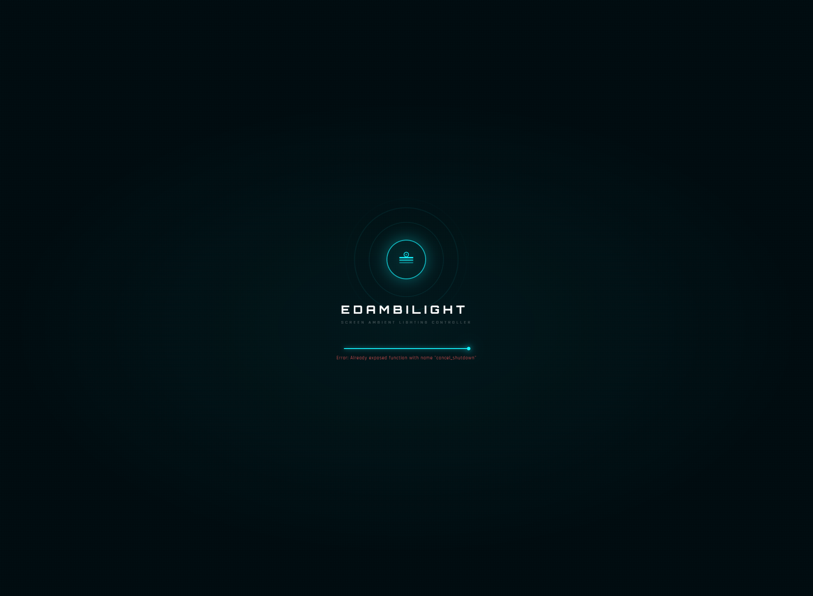
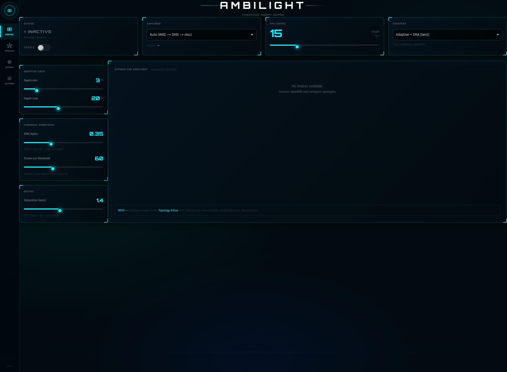
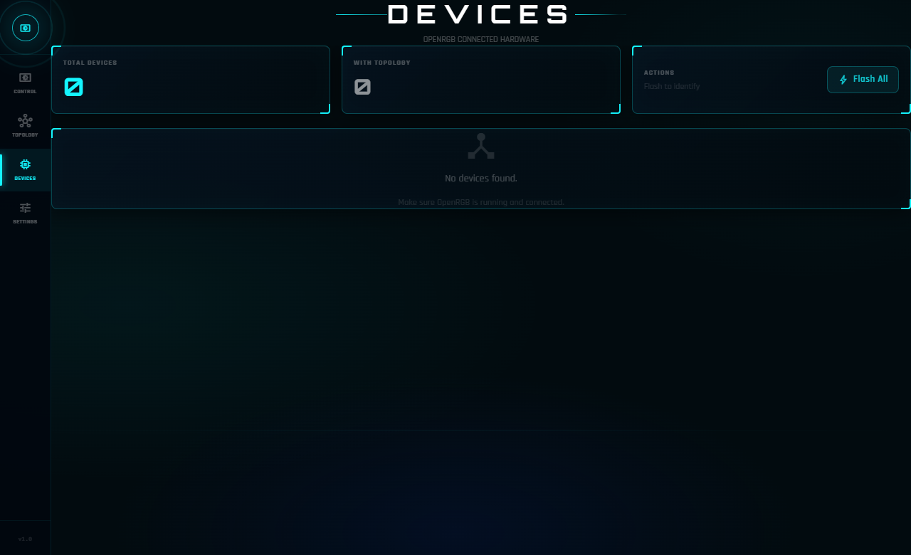
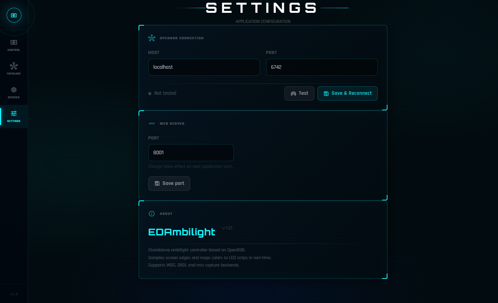

# EDAmbilight

A standalone screen ambient lighting controller for Windows. Samples the edges of your monitor in real time and drives RGB LED strips through [OpenRGB](https://openrgb.org).

---

## Features

- **Real-time screen capture** — samples all four monitor edges (right, top, left, bottom) at up to 30 fps
- **Multiple capture backends** — WGC (Windows Graphics Capture), DXGI Desktop Duplication, mss; auto-selected for best performance
- **Black bar detection** — automatically ignores letterbox / pillarbox borders for accurate color sampling
- **Smooth transitions** — exponential moving average with scene-cut detection for flicker-free output
- **Saturation boost** — makes colors more vivid on LED strips without oversaturation
- **Visual topology editor** — drag-and-drop canvas to map physical LED zones to screen regions
- **Live preview** — WebGL shader preview of the ambient effect in the browser
- **System tray** — minimizes to tray; the UI stays accessible from your browser
- **No internet required** — entirely local; no cloud, no telemetry

---

## Requirements

| | |
|---|---|
| OS | Windows 10 / 11 (64-bit) |
| [OpenRGB](https://openrgb.org) | version 0.9 or later |
| Screen | any resolution, single monitor |

> **OpenRGB must be running** with its SDK Server enabled before starting EDAmbilight.
> In OpenRGB: *Settings → SDK Server → Start Server*

---

## Installation

1. Go to the [Releases](../../releases) page and download the latest `EDAmbilight-vX.X.X.zip`
2. Extract the zip to any folder (e.g. `C:\Tools\EDAmbilight\`)
3. Start OpenRGB and enable the SDK Server (port 6742 by default)
4. Double-click **EDAmbilight.exe**

No Python installation or additional dependencies are required.

---

## Screenshots

| Dashboard | Devices |
|---|---|
|  |  |

| Settings | Topology Editor |
|---|---|
|  | *(accessible from Devices page)* |

---

## First Run

On first launch a splash screen appears while EDAmbilight:

1. Connects to OpenRGB (or attempts to start it automatically)
2. Initialises the ambilight sampling service
3. Registers the API endpoints

Once ready, the browser opens the dashboard automatically.  
If OpenRGB is not running you will see an error banner — start OpenRGB, enable the SDK Server, then click **Retry**.

A `config/` folder is created automatically in the same directory as the exe.

---

## Configuration

All configuration lives in `config/` next to the executable:

### `config/settings.json`

| Key | Default | Description |
|---|---|---|
| `openrgb_host` | `"localhost"` | OpenRGB SDK server host |
| `openrgb_port` | `6742` | OpenRGB SDK server port |
| `openrgb_path` | `""` | Manual path to `openrgb.exe` (empty = autodetect) |
| `openrgb_autostart` | `true` | Start OpenRGB automatically if not running |
| `web_port` | `8001` | Port for the built-in web UI |

### `config/ambilight_config.json`

| Key | Default | Description |
|---|---|---|
| `enabled` | `true` | Master on/off switch |
| `capturer` | `"auto"` | Capture backend: `auto`, `wgc`, `dxgi`, `mss` |
| `fps` | `10` | Target sampling rate (frames per second) |
| `strategy` | `"adaptive_smooth"` | Sampling strategy (see below) |
| `depth` | `10` | Base sampling depth as % of screen width/height |
| `saturation_boost` | `1.6` | Saturation multiplier (`1.0` = no boost) |
| `ema_alpha` | `0.5` | Smoothing factor — higher = faster response |
| `scene_cut` | `43` | Per-LED delta that triggers an instant cut instead of a smooth transition |
| `adaptive_min` | `3` | Minimum depth % when adaptive mode is active |
| `adaptive_max` | `18` | Maximum depth % when adaptive mode is active |
| `black_bar_detect` | `true` | Detect and skip black letterbox/pillarbox borders |

**Sampling strategies:**

| Strategy | Description |
|---|---|
| `adaptive_smooth` | Adaptive depth + EMA temporal smoothing (recommended) |
| `smooth` | Fixed depth + EMA smoothing |
| `percentile` | 80th-percentile luminance pixel — vibrant, few bright outliers |
| `dominant` | Median pixel — stable, natural colors |
| `mean` | Average all pixels — accurate but can look washed out |

### `config/device_topologies.json`

Stores the LED zone layout created in the Topology Editor. Edit visually from the Devices page — no manual JSON editing required.

---

## Topology Editor

The Topology Editor lets you map each physical LED zone to a region of the screen:

1. Open **Devices** from the sidebar
2. Select a device and click **Edit Topology**
3. Drag zones onto the screen canvas and assign them to edges (Right / Top / Left / Bottom)
4. Save — changes take effect immediately

---

## Troubleshooting

**EDAmbilight says "OpenRGB not found"**  
Make sure OpenRGB is running and the SDK Server is enabled on port 6742.  
If OpenRGB is installed in a non-standard location, set `openrgb_path` in `config/settings.json`.

**LEDs do not respond**  
- Check that the correct device and zone are enabled in the Devices page
- Verify that OpenRGB can control your devices without EDAmbilight (use the OpenRGB UI directly)

**UI does not open in the browser**  
Navigate manually to `http://localhost:8001` (or the port configured in `settings.json`).

**High CPU usage**  
Lower the `fps` value in `config/ambilight_config.json` (e.g. `5` or `8`).  
If using `mss` as the capturer, switching to `wgc` or `dxgi` can significantly reduce CPU load.

**Colors look washed out**  
Increase `saturation_boost` (try `1.8`–`2.0`).

**Colors flicker or jump**  
Reduce `ema_alpha` (e.g. `0.3`) for smoother transitions, or lower `scene_cut` to require a larger delta before triggering an instant cut.

---

## License

MIT License — see [LICENSE](LICENSE).
